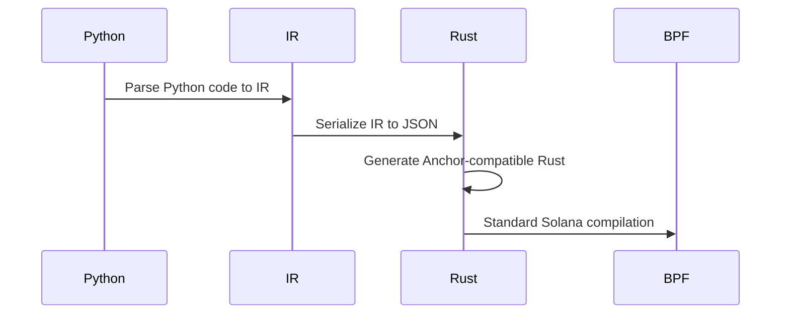

# Dolphin Architecture Deep Dive

## Compilation Pipeline


## Key Components

### 1. Python Parser (`python/dolphin/parser.py`)
- Converts Python code to Intermediate Representation (IR)
- Handles Solana-specific decorators and type annotations
- Example transformation:
```python
# Input Python
@instruction
def play(self, state: GameState, player: Signer):
    state.score += 1

# Output IR
{
    "instruction": "play",
    "accounts": [{"name": "state", "type": "GameState"}],
    "arguments": [{"name": "player", "type": "Signer"}],
    "body": [
        {"Assignment": {
            "target": "state.score",
            "value": {"BinaryOp": {
                "left": "state.score",
                "op": "+",
                "right": 1
            }}
        }}
    ]
}
```

### 2. Intermediate Representation (IR)
- Shared structure between Python and Rust
- Defined in both:
  - Python: `python/dolphin/ir.py`
  - Rust: `src/compiler/ir.rs`
- PyO3 usage example:
```rust
// Rust IR struct with Python bindings
#[pyclass]
#[derive(Serialize, Deserialize)]
pub struct Instruction {
    pub name: String,
    pub arguments: Vec<InstructionArgument>,
    #[pyo3(get)]  // Expose to Python
    pub accounts: Vec<AccountUsage>,
}
```

### 3. Code Generator (`src/compiler/codegen.rs`)
- Transforms IR to Solana-compatible Rust
- Example output:
```rust
// Generated Rust
pub fn play(ctx: Context<Play>, player: Pubkey) -> Result<()> {
    let state = &mut ctx.accounts.state;
    state.score = state.score.checked_add(1)
        .ok_or(ErrorCode::Overflow)?;
    Ok(())
}
```

## PyO3 Integration Strategy
| Component          | Python Side              | Rust Side                | Communication          |
|---------------------|--------------------------|--------------------------|------------------------|
| IR Definition       | `ir.py` classes          | `ir.rs` structs          | PyO3 bindings          |
| Serialization       | `to_json()`              | `serde-json`             | JSON files             |
| Compilation Trigger | `dolphin build` command  | `cargo build-bpf`        | CLI invocation         |

## Common Misconceptions
❌ "PyO3 is used to run Python on Solana"
✅ **Reality**: PyO3 is only used during *development time* to share IR definitions between the Python-based frontend and Rust-based compiler

❌ "Python code is directly executed on-chain"
✅ **Reality**: Python is compiled to standard Solana programs through multiple transformation stages
